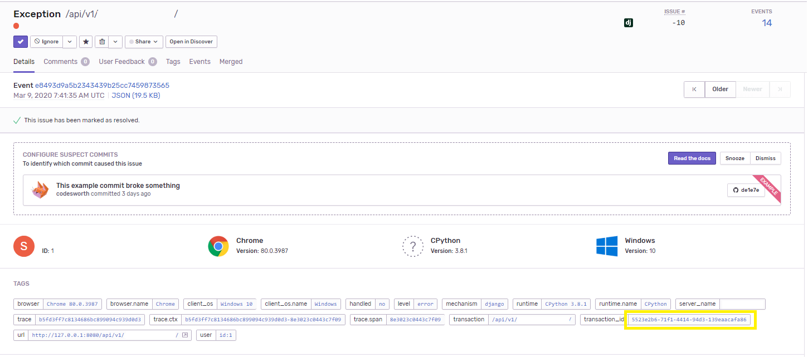
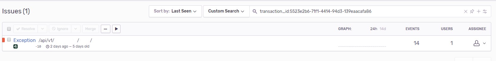

.. _integrations:

************
Integrations
************

Integrations are optional add-ins used to extend the functionality of the Django GUID middleware.

To enable an integration, simply add an integration instance to the ``INTEGRATIONS`` field in ``settings.py``,
and the relevant integration logic will be executed in the middleware:

.. code-block:: python

    from django_guid.integrations import SentryIntegration

    DJANGO_GUID = {
        ...
        'INTEGRATIONS': [SentryIntegration()],
    }

Integrations are a new addition to Django GUID, and we plan to expand selection in the future. If you are looking for specific functionality that is not yet available, consider creating an issue, making a pull request, or writing your own private integration. Custom integrations classes are simple to write and can be implemented just like package integrations.

Available integrations
======================

Sentry
------

Integrating with Sentry, lets you tag Sentry-issues with a ``transaction_id``. This lets you easily connect an event in Sentry to your logs.

Rather than changing how Sentry works, this is just an additional piece of metadata that you can use to link sources of information
about an exception. If you know the GUID of an exception, you can find the relevant Sentry issue by searching for the tag:

To add the integration, simply import ``SentryIntegration`` from the integrations folder and add it to your settings:

.. code-block:: python

    from django_guid.integrations import SentryIntegration

    DJANGO_GUID = {
        ...
        'INTEGRATIONS': [SentryIntegration()],
    }

Writing your own integration
============================

Creating your own custom integration requires you to inherit the ``Integration`` base class (which is found `here <https://github.com/JonasKs/django-guid/tree/master/django_guid/integrations/base>`_).

The class is quite simple and only contains four methods and a class attribute:

.. code-block:: python

    class Integration(object):
        """
        Integration base class.
        """

        identifier = None  # The name of your integration

        def __init__(self) -> None:
            if self.identifier is None:
                raise ImproperlyConfigured('`identifier` cannot be None')

        def setup(self) -> None:
            """
            Holds validation and setup logic to be run when Django starts.
            """
            pass

        def run(self, guid: str, **kwargs) -> None:
            """
            Code here is executed in the middleware, before the view is called.
            """
            raise ImproperlyConfigured(f'The integration `{self.identifier}` is missing a `run` method')

        def cleanup(self, **kwargs) -> None:
            """
            Code here is executed in the middleware, after the view is called.
            """
            pass

To extend this into a fully functioning integration, all you need to do is

1. Create a new class that inherits the base class
2. Set the identifier to a string, naming your integration
3. Add the logic you wish to be executed to the ``run`` method
4. Add logic to each of the remaining methods as required

A fully functioning integration can be as simple as this:

.. code-block:: python

    from django_guid.integrations import Integration

    class CustomIntegration(Integration):

        identifier = 'CustomIntegration'  # Should be a string

        def run(self, guid, **kwargs):
            print('This is a functioning Django GUID integration')

There are four built in methods which are always called. You can chose to override these in your custom
integration.

Method descriptions
--------------------

Setup
^^^^^
The ``setup`` method is run when Django starts, and is a good place to keep your integration-specific validation logic,
like, e.g., making sure all dependencies are installed:

.. code-block:: python

    from third_party_sdk import start_service

    class CustomIntegration(Integration):

        identifier = 'CustomIntegration'

        def setup(self):
            try:
                import third_party_sdk
            except ModuleNotFoundError:
                raise ImproperlyConfigured(
                    'Package third_party_sdk must be installed'
                )
Run
^^^

The ``run`` method is required, and is designed to hold code that should be executed each time the middleware is run
(for each request made to the server), before the view is called.

This function **must** accept both ``guid`` and ``**kwargs``. Additional arguments are likely be added
in the future, and so the function must be able to handle those new arguments.

.. code-block:: python

    from third_party_sdk import send_guid_to_system

    class CustomIntegration(Integration):

        identifier = 'CustomIntegration'

        def setup(self):
            ...

        def run(self, guid, **kwargs):
            send_guid_to_system(guid=guid)

Cleanup
^^^^^^^

The ``cleanup`` method is the final method called in the middleware, each time the middleware, each time the middleware is run,
after a view has been called.

This function **must** accept ``**kwargs``. Additional arguments are likely be added
in the future, and so the function must be able to handle those new arguments.

.. code-block:: python

    from third_party_sdk import clean_up_guid

    class CustomIntegration(Integration):

        identifier = 'CustomIntegration'

        def setup(self):
            ...

        def run(self, guid, **kwargs):
            ...

        def cleanup(self, **kwargs):
            clean_up_guid()
